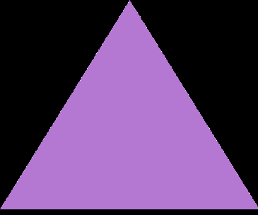
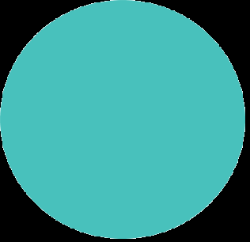

# BCI4ALS P300
## What is This Project
This project is an extension of the [BCI4ALS project](https://github.com/evyatarluv/bci4als), and aims to build an easy interface for [P300](https://en.wikipedia.org/wiki/P300_(neuroscience)) paradigm.  
Here the user is asked to concentrate on one of the following shapes:

<p float="left">
  
   
  
</p>

Which represent 3 types of stimuli: idle, target and distractor.  
While displayed the brain activity is recorded and at the end a classification algorithm applied to classify the activity into the 3 categories.  
We used [CSP](https://en.wikipedia.org/wiki/Common_spatial_pattern) followed by [LDA](https://en.wikipedia.org/wiki/Linear_discriminant_analysis).  

## How to Install
First clone the repository:
 ```sh
 git clone https://github.com/ellaHerzberg/BCI4ALS_P300.git
 ```
 Then install the requirements:
  ```sh
 cd BCI4ALS_P300
pip install -r requirements.txt
 ```
 
 ## How to Use
 On the first time run offline_experiment which records the brain activity and saves the CSP-LDA trained model.  
 The next trials should be to the user choice, whether running more offline trainings or an online training which implements [incremental learning](https://en.wikipedia.org/wiki/Incremental_learning).
 
 
